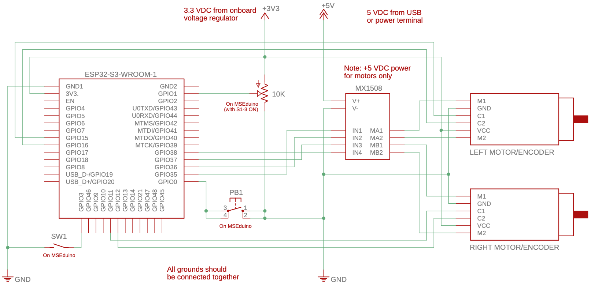
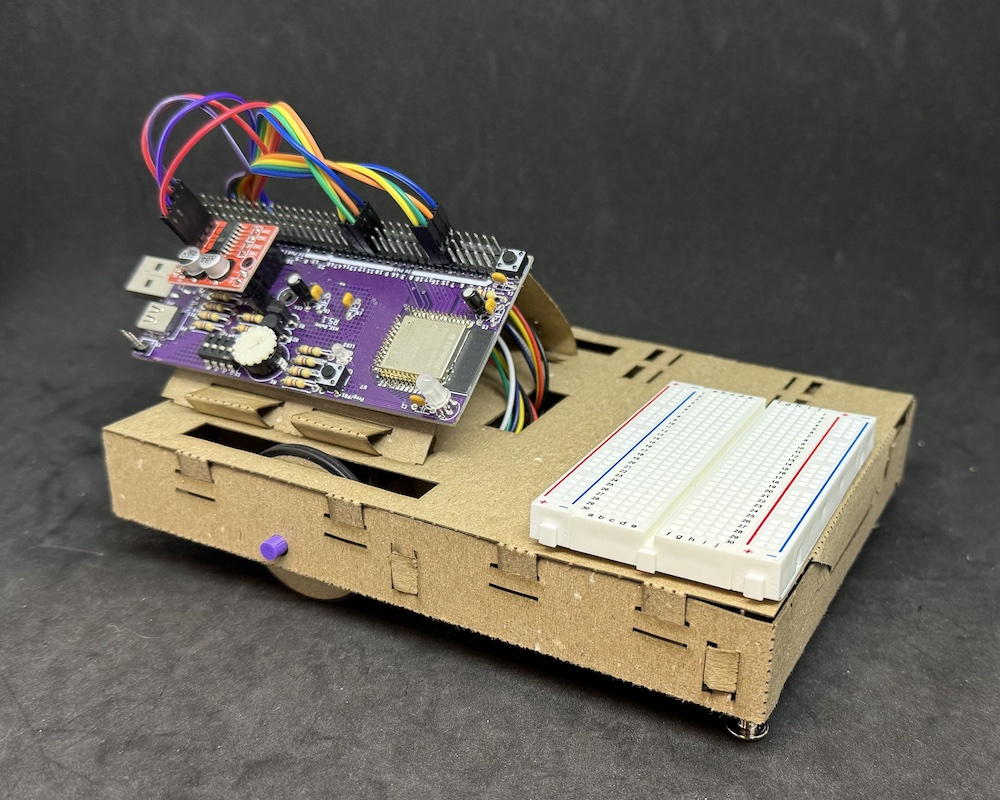

# Lab 3

## Objectives

The objective of this laboratory assignment is to develop the skills required to build assemblies from laser-cut components and construct a functional differential-drive robot chassis. By the end of the lab each student should:

By the end of the lab each student should:

1. Be familiar with some techniques for building assemblies from laser-cut card stock components
2. Be able to obtain and use code from GitHub
3. Have a working MSEbot chassis
4. Be able to program an MSEbot for a simple task

### Hardware Required

For this lab, you will require the MSEduino board that was assembled in Lab 1, along with other components found in the MSE 2202 Lab Kit. These include:

* MSEduino ESP32-S3 based development board
* Geared mini DC motor ⨉ 2 with female-end Dupont connector wires
* MX1508 dual DC motor driver
* Gecko sticky dots ⨉ 5
* Modular solderless breadboard
* Rechargable USB battery
* USB-A male to USB-A female cable for connecting battery to MSEduino
* USB-A male to mirco-USB male cable for charging battery

### Equipment

In addition to the components contained in the Lab Kit, the following equipment is available in ACEB 3435 for the purpose of conducting this laboratory:

* Needle-nose pliers
* Flush cutters
* Slot screwdriver
* Agilent Technologies U3401A multimeter
* Rigol MSO1074 4 Channel 70 MHz oscilloscope
* PC with Arduino IDE

## MSEbot Assembly

Before starting with the assembly process, use a USB-A to micro-USB cable to connect your rechargeable USB battery to a computer or wall charger to charge up. Note that the battery can only be charged with supplies that do not exceed an output current of 1 A. **Exceeding this limit may cause damage to the battery and/or cause it to catch fire.** The USB ports on most computers are limited to 500 mA, but many wall chargers deliver up to 2.4 A.

Assembly instructions for the chassis (or base) of the MSEbot are outlined in [MSEbot Chassis Build Instructions](docs/MSEbot_chassis_build.pdf). The entire MSEbot chassis build is also demonstrated the video below. The video walks through the assembly process with live-action tips and demonstrations. For this reason, it recommended that, in addition to carefully reading the instructions, the video be watched far enough ahead to ensure that all of the relevant information and guidance has been viewed for each step.

The build steps for the MSEbot chassis are as follows:

1. [[00:03]](https://www.youtube.com/watch?v=ve4cuApd-Hs&t=3s) Overview of MSEbot chassis components
2. [[01:03]](https://www.youtube.com/watch?v=ve4cuApd-Hs&t=63s) Preparing Component 1
3. [[02:20]](https://www.youtube.com/watch?v=ve4cuApd-Hs&t=140s) Joining Components 1 and 2
4. [[03:38]](https://www.youtube.com/watch?v=ve4cuApd-Hs&t=218s) Joining Components 1 and 3
5. [[04:28]](https://www.youtube.com/watch?v=ve4cuApd-Hs&t=268s) Preparing Component 4
6. [[05:25]](https://www.youtube.com/watch?v=ve4cuApd-Hs&t=325s) Joining Component 4 with Components 1, 2, and 3
7. [[06:07]](https://www.youtube.com/watch?v=ve4cuApd-Hs&t=367s) Joining Component 5 with Components 1, 2, and 3
8. [[06:42]](https://www.youtube.com/watch?v=ve4cuApd-Hs&t=402s) Adding Chicago bolts to Component 1
9. [[07:24]](https://www.youtube.com/watch?v=ve4cuApd-Hs&t=444s) Joining Component 6 with Components 1, 2, and 3
10. [[07:53]](https://www.youtube.com/watch?v=ve4cuApd-Hs&t=473s) Folding front of chassis
11. [[08:34]](https://www.youtube.com/watch?v=ve4cuApd-Hs&t=514s) Folding rear of chassis
12. [[08:53]](https://www.youtube.com/watch?v=ve4cuApd-Hs&t=533s) Assembling wheels and hubs
13. [[09:56]](https://www.youtube.com/watch?v=ve4cuApd-Hs&t=596s) Trimming Component 4 for motors (if necessary)
14. [[10:25]](https://www.youtube.com/watch?v=ve4cuApd-Hs&t=625s) Installing motors and wheels into chassis
15. [[13:07]](https://www.youtube.com/watch?v=ve4cuApd-Hs&t=787s) Folding Component 4 over motor wires
16. [[13:44]](https://www.youtube.com/watch?v=ve4cuApd-Hs&t=824s) Folding Component 11
17. [[16:01]](https://www.youtube.com/watch?v=ve4cuApd-Hs&t=961s) Joining Components 11 and 12
18. [[17:07]](https://www.youtube.com/watch?v=ve4cuApd-Hs&t=1027s) Adding Gecko sticky dots to Component 11
19. [[17:35]](https://www.youtube.com/watch?v=ve4cuApd-Hs&t=1055s) Preparing Component 12
20. [[18:18]](https://www.youtube.com/watch?v=ve4cuApd-Hs&t=1098s) Joining Components 1 and 12
21. [[20:50]](https://www.youtube.com/watch?v=ve4cuApd-Hs&t=1250s) Adding Gecko sticky dot to Component 12
22. [[21:25]](https://www.youtube.com/watch?v=ve4cuApd-Hs&t=1285s) Installing modular solderless breadboard
23. [[21:36]](https://www.youtube.com/watch?v=ve4cuApd-Hs&t=1296s) Routing motor wires
24. [[21:59]](https://www.youtube.com/watch?v=ve4cuApd-Hs&t=1319s) Connecting motors and encoders to MSEduino
25. [[23:41]](https://www.youtube.com/watch?v=ve4cuApd-Hs&t=1421s) Attaching MSEduino to MSEbot
26. [[24:13]](https://www.youtube.com/watch?v=ve4cuApd-Hs&t=1453s) Connecting battery to MSEduino

The electrical connections are as follows:

The assembled chassis of the MSEbot should resemble the one shown below:

## Initial MSEbot Testing

In order to test the functionality of the MSEbot, test code must be loaded onto the MSEduino. The test code requires the [Adafruit NeoPixel Library](https://github.com/adafruit/Adafruit_NeoPixel), which you should have installed for [Lab 1](https://github.com/MSE2202/Lab1). If necessary, see the installation instructions [here](https://github.com/MSE2202/Lab1/blob/main/docs/MSEduino-testing.md#library-installation) for details. 

From there, you can clone this repository, which contains the MSEbot base code in the [Lab3](Lab3) folder.

Before programming, ensure that all of the DIP switches are in the ON position. This will enable the Smart LED (S1-4) and potentiometer (S1-3). SW1 (S1-1) serves to enable/disable and disable the motors (i.e., the motors will not turn when off). The potentiometer controls the speed of the motors. Note that if the pot is rotated fully clockwise, the motor speed will be very slow; rotate counterclockwise to increase the motor speed.

When the program has finished uploading, you should see the built-in LED on the MSEduino slowly flash red. To run the robot, disconnect the USB cable used for programming and install a USB battery. **Before running the robot, place it on the floor in an area with no obstructions**. Ideally the robot has half a metre of clear space in all directions. PB1 is used to stop and start the robot. If pressed once, the LED slowly flashes green and the robot waits for 5 seconds before running the sequence below indefinitely: 

1. Drive forward for 2 seconds
2. Drive backward for 2 seconds
3. Spin counterclockwise for 2 seconds
4. Spin clockwise for 2 seconds
5. Stop for 2 seconds

Pressing PB1 again will immediately stop the robot. It can be started again by pressing PB1. If your robot moves in a different sequence, the connections for one or both motors to the DC motor driver may need to be reversed. If your robot drives according to the sequence above, the drive system of your MSEbot is built correctly. Congratulations!

You can also connect your MSEbot to a computer and use the serial monitor to observe the debugging messages to ensure that the encoder counts are updating in an expected manner. For this test, it may be useful to use the battery to prop up the rear end of the MSEbot so that the wheels can spin freely while the robot remains stationary.

A demonstration of MSEbot running the test code may be seen in the video below.

### Build and Flash

Open the [Arduino IDE](https://www.arduino.cc/en/software) and configure it for the ESP32. Use a USB-A extension cable to connect your MSEduino to your computer. Use the **Tools→Board→esp32** menu to select the **Adafruit Feather ESP32-S3 No PRAM board**. The Port should be set as **COMx** on Windows or **dev.cu.usbmodel14101** (or similar) on Mac. The code provided with this lab requires version 2.0.11 of the Arduino-ESP32 boards. Use the **Tools→Board→Boards Manager...** menu and find the **esp32 by Espressif** board package. Confirm that the version is **2.0.11**. If necessary, use the dropdown menu to change versions. The code will not work in versions 3.0+ due to changes made to the underlying esp-idf API.

#### VSCode and PlatformIO

Note that as an alternative to the Arduino IDE, this project can be developed using [VSCode](https://code.visualstudio.com) with the [PlatformIO IDE](https://platformio.org/platformio-ide) extension and the [Espressif 32 platform](https://registry.platformio.org/platforms/platformio/espressif32) installed.

## Exercise

You will need to have [git](https://git-scm.com) installed on your computer for all lab exercises. You can [download](https://git-scm.com/downloads) and install git if it is not already on your computer. 

Create a new branch **exercise** and switch to it. Modify the MSEbot basecode so that 2 seconds after pushing PB1, your MSEbot does the following:

1. Drive forward 50 cm
2. Drive backward 25 cm
3. Pause for 4 seconds
4. Drive backward 25 cm 
5. Pause for 2 seconds
6. Leave drive mode

The Smart LED should change colour when moving and turn back to red when the sequence is finished. Utilize the motor encoder counts (mapped to the distance travelled for each rotation of the wheel) to control the distance that the MSEbot travels in Steps 1, 2, and 4. If all goes well, your MSEbot should stop in roughly the same place that it started from. Pressing PB1 again will restart the sequence. Show your working MSEbot to a TA. If you have not done so already, be sure to __*push your respository back to GitHub*__.  __**Failure to do so will result in a grade of 0 for the lab.**__

A demonstration the exercise may be seen in the video below.

### Other Things to Explore

1. Implement other drive sequences of your choosing.
2. Adjusting the PWM signals sent to one of the motors to account for any differences in motor speed between the right and left motors. This should result in the robot maintaining a better straight line when driving forward or reverse.
3. Using the PID code included in Lab 2, implement a PID-based drive system that further improves the drive accuracy.

## Resources

* [Arduino Language Reference](https://www.arduino.cc/reference/en/)
* [Arduino-ESP32 GPIO API](https://docs.espressif.com/projects/arduino-esp32/en/latest/api/gpio.html)
* [GPIO Peripheral Reference](https://docs.espressif.com/projects/esp-idf/en/latest/esp32/api-reference/peripherals/gpio.html)
* [Arduino-ESP32 LEDC API](https://docs.espressif.com/projects/arduino-esp32/en/latest/api/ledc.html)
* [LEDC Peripheral Reference](https://docs.espressif.com/projects/esp-idf/en/latest/esp32/api-reference/peripherals/ledc.html)
* [SG90 RC Servo Motor Data Sheet](http://www.ee.ic.ac.uk/pcheung/teaching/DE1_EE/stores/sg90_datasheet.pdf)
* [G12-N20-100 Geared Mini DC Motor](https://www.handsontec.com/dataspecs/motor_fan/GA12-N20.pdf)
* [G12-N20-100 Specifications](docs/GA12-N20_specs.png)
* [MX1508 Dual DC Motor Driver](https://components101.com/modules/mx1508-dc-motor-driver-pinout-features-datasheet)

## Evaluation

Note that to avoid confusion with a colleague's MSEbot, a clear identifying mark (e.g., your name) must be made on your MSEduino and MSEbot. **Robots without distinct marks will not be graded.**

| Task                            | Maximum Marks | Demo | Code | Comments |
|:--------------------------------|:-------------:|:----:|:----:|:--------:|
| MSEbot built correctly          | **50**        | 50   | —    | —        |
| MSEbot drive system operational | **25**        | 25   | —    | —        |
| Exercise                        | **25**        | 13   | 6    | 6        |
